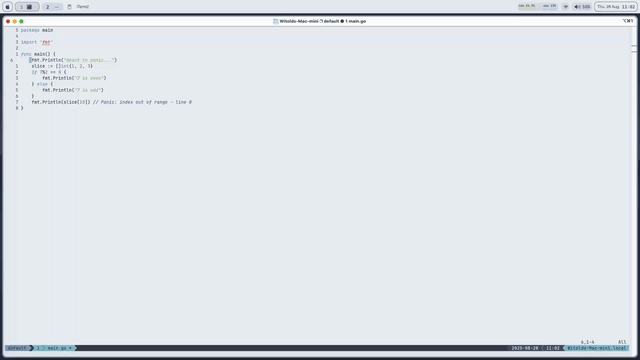
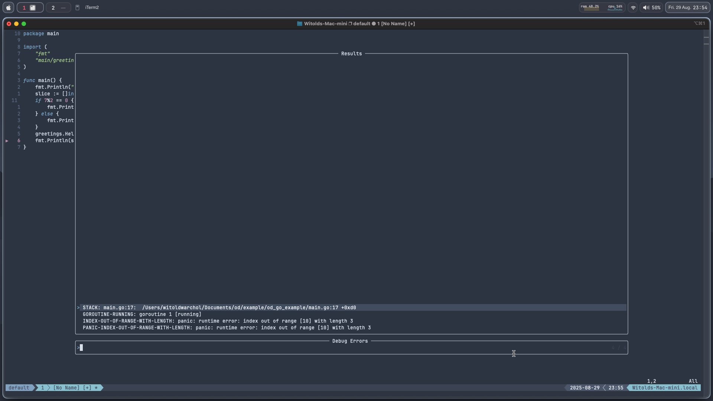
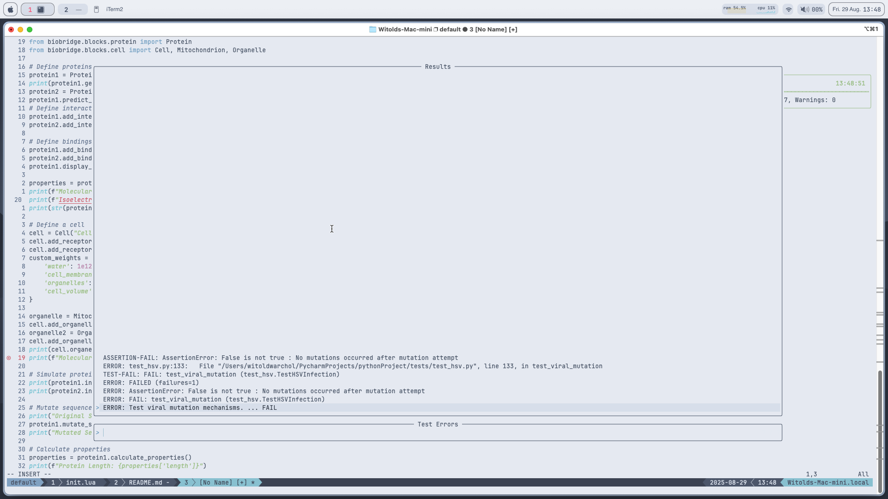

# OD (Onto Debug)
Onto Debug is a neovim plugin designed to help debugging, testing
(so debugging really) but not act as a full debugger protocol or a 
testing framework. It's whole design point is also to run only on demand.

[](od_showcase.mov)

## Installation:
To install use your preferred plugin manager I will use here vim plug for 
example.
```vim
Plug 'nvim-telescope/telescope.nvim'
Plug 'rcarriga/nvim-notify'
Plug 'Okerew/od.nvim'
```
### Also depending on the language you need these tools:

**C/Cpp:**
gcc, gdb, valgrind, cmake

**Rust**
clippy, cargo

**Go**:
delve

**Javscript**:
jest

**Lua**:
busted

## Features:
### Run

Runs the current file with the designed debug path and when encountering
errors, warnings parses them to telescope pickers and allows faster movement
and debugging.

**Through:**
* If clicking enter on a picker select with line attribute goes to that line
* When clicking enter on a goroutine or thread attribute copies the given one
for faster debugging with a counting method
- **Gdb integration** allows for the same thing that run allows just with Gdb 
output, also provides support for remote gdb debugging.

### Breakpoints, watchpoints, tracepoints
Although we don't have a full dap integration we still can make using
breakpoints faster and we do, all copies are done to unnamedplus.

**Through:**
* Copies filename:line by default if on if copies `filename:line <if condition>`
, if near a goroutine it copies `if goid == accurence_of_goroutine`, if we are on
a function copies `filename:function_name` for delve and `function_name` for gdb,
if we are on a variable name and we have a watchpoint it does `variable_name`.
* Smartly uses the correct command so `break`, `watch` or `trace`.
* Smartly appends breakpoints to a breakpoints list, allowing to quickly
move in file through a telescope picker.
* Counts breakpoints/watchpoints/tracepoints you put and if calling clear for 
one does `clear iterance_id` for delve and for gdb `del iterance_id`.

### Testing 

Supports testing integration for rust clippy, cargo test, golang, python, jest, 
lua, by using a telescope picker to view error lines, failed tests and allows 
quick hopping to the lines, also allows to run specific tests in file.

### Build
Allows for faster building and debugging of builds for golang, cmake files and
has cmake integration for debugging and run.

## Commands
**Debug:**
* `ODRun`: Compiles and runs the current file along with extracting compile and
runtime errors, warnings to a telescope picker.
* `ODErrors`: Shows the error picker.
* `ODWarnings`: Shows the warning picker.
* `ODOutput`: Shows the raw output of ODRun.
* `ODClearTelescopeItems`: Clears diagnostic signs placed by OD.

**Rust:**
* `ODRustClippy`: Runs clippy for a rust project with picker logic.
* `ODRustTest`: Runs a rust test with picker logic.

**Go:**
* `ODGoBuild`: Builds a go project shows errors, warnings in picker.
* `ODGoTest`: Tests a go test shows errors, warnings in picker.

**CMake:**
* `ODCMakeConfigure`: Congigures CMake shows errors, warnings in picker.
* `ODCMakeBuild`: Builds cmake project shows errors, warnings in picker.
* `ODCMakeTest`:  Runs a cmake test with picker logic.

**GDB:**
* `ODGdbDebug`: Opens a gdb session and shows errors and warnings in picker.
* `ODGdbRemote`:  Opens a remote gdb session and shows errors and warnings in picker.

**Breakpoints, tracepoints, watchpoints:**
* `ODAddBreakpoint`: Adds a breakpoint add the current line and copies the
command for placing a breakpoint.
* `ODRemoveBreakpoint`: Removes a breakpoint assigned to the current line,
copies the command for removing a breakpoint depending on filetype.
* `ODListPoints`: Lists breakpoints, watchpoints, tracepoints in a picker.
* `ODAddWatchpoint`: Adds a watchpoint add the current line and copies the
command for placing a watchpoint.
* `ODRemoveWatchpoint`: Removes a watchpoint assigned to the current line,
copies the command for removing a watchpoint depending on filetype.
* `ODAddTracepoint`: Removes a tracepoint assigned to the current line,
copies the command for removing a tracepoint depending on filetype.
* `ODRemoveTracepoint`: Removes a tracepoint assigned to the current line,
copies the command for removing a watchpoint depending on filetype.
* `ODClearPoints`: Clears breakpoints, watchpoints, tracepoints.

**Python, jest, busted tests:**
* `ODPythonTest`: Runs a python test with picker logic.
* `ODJestTest`: Runs a jest test with picker logic.
* `ODBustedTest`: Runs a busted test with picker logic.

## Config
If you just want to start using this plugin copy this config, keybindings are not needed to
use OD, but are useful.

``` lua
-- NECESSARY THESE LINES MUST BE DEFINED FOR OD TO WORK
vim.fn.sign_define("ODBreakpointSign", { text = "●", texthl = "ErrorSign" })
vim.fn.sign_define("ODTelescopeItem", {
		text = "▶",
		texthl = "DiagnosticSignWarn",
		numhl = "DiagnosticSignWarn",})
local od = require('od')
od:setup()
-- END OF NECESSARY LINES

-- KEYBINDINGS ARE NOT NEEDED BUT ARE USEFUL
-- General OD mappings
vim.keymap.set("n", "<leader>odr", function() od:debug() end, { desc = "Run debugger" })
vim.keymap.set("n", "<leader>ode", function() od:show_errors() end, { desc = "Show errors" })
vim.keymap.set("n", "<leader>odw", function() od:show_warnings() end, { desc = "Show warnings" })
vim.keymap.set("n", "<leader>odo", function() od:show_output() end, { desc = "Show output" })
vim.keymap.set("n", "<leader>oci", function() od:clear_telescope_items() end, { desc = "Clear Telescope Items" })

-- Rust-specific
vim.keymap.set("n", "<leader>orc", function() od:rust_clippy() end, { desc = "Run Rust Clippy" })
vim.keymap.set("n", "<leader>otr", function() od:rust_test() end, { desc = "Run Rust Test" })

-- Go-specific
vim.keymap.set("n", "<leader>ogb", function() od:go_build() end, { desc = "Go Build" })
vim.keymap.set("n", "<leader>ogt", function() od:go_test() end, { desc = "Go Test" })

-- CMake
vim.keymap.set("n", "<leader>occ", function() od:cmake_configure() end, { desc = "CMake Configure" })
vim.keymap.set("n", "<leader>ocb", function() od:cmake_build() end, { desc = "CMake Build" })
vim.keymap.set("n", "<leader>otc", function() od:ctest() end, { desc = "Run CMake Test" })

-- GDB
vim.keymap.set("n", "<leader>ogdb", function() od:gdb_debug() end, { desc = "GDB Debug" })
vim.keymap.set("n", "<leader>ogr", function() od:gdb_remote() end, { desc = "GDB Remote" })

-- Copy breakpoints, watchpoints, tracepoints (You didnt think I would programm a whole dap logic now did you :)
vim.keymap.set("n", "<leader>oab", function() od:copy_breakpoint() end, { desc = "Add breakpoint" })
vim.keymap.set("n", "<leader>orb", function() od:copy_clear_breakpoint() end, { desc = "Remove breakpoint" })
vim.keymap.set("n", "<leader>oca", function() od:clear_breakpoints() end, { desc = "Clears breakpoints, watchpoints, tracepoints" })
vim.keymap.set("n", "<leader>ol", function() od:show_breakpoints_picker() end, { desc = "List brakpoints, watchpoints, tracepoints" })
vim.keymap.set("n", "<leader>oaw", function() od:copy_watchpoint() end, { desc = "Add watchpoint" })
vim.keymap.set("n", "<leader>orw", function() od:copy_clear_watchpoint() end, { desc = "Remove watchpoint" })
vim.keymap.set("n", "<leader>oat", function() od:copy_tracepoint() end, { desc = "Add tracepoint" })
vim.keymap.set("n", "<leader>ort", function() od:copy_clear_tracepoint() end, { desc = "Remove tracepoint" })

-- Test integration for python, javascript/typepescript, lua
vim.keymap.set("n", "<leader>otp", function() od:python_test() end, { desc = "Run Python Test" })
vim.keymap.set("n", "<leader>otj", function() od:js_test() end, { desc = "Run Jest Test" })
vim.keymap.set("n", "<leader>otb", function() od:busted_test() end, { desc = "Run Busted Test" })
```

**Default debugger configs** it's not recommended to modify them unless you
know what you are doing, note these are setup by default when calling od setup

```lua
debuggers = {
    c = {
        cmd = "gcc",
        args = { "-g", "-Wall", "-Wextra", "-fsanitize=address", "-fsanitize=undefined", "-o", "debug_program" },
        run_args = {
            "valgrind",
            "--tool=memcheck",
            "--leak-check=full",
            "--show-leak-kinds=all",
            "--track-origins=yes",
            "./debug_program",
        },
        cmake_configure_args = { "cmake", "-DCMAKE_BUILD_TYPE=Debug", "-DCMAKE_EXPORT_COMPILE_COMMANDS=ON", "." },
        cmake_build_args = { "cmake", "--build", ".", "--config", "Debug" },
        cmake_install_args = { "cmake", "--build", ".", "--target", "install" },
        test_args = { "ctest", "--verbose", "--output-on-failure" },
        -- GDB support
        gdb_args = { "gdb", "--batch", "--ex", "run", "--ex", "bt", "--args" },
        gdb_remote_args = { "gdb", "--batch", "-ex", "target remote :1234", "-ex", "continue", "-ex", "bt" },
    },
    cpp = {
        cmd = "g++",
        args = { "-g", "-Wall", "-Wextra", "-fsanitize=address", "-fsanitize=undefined", "-o", "debug_program" },
        run_args = {
            "valgrind",
            "--tool=memcheck",
            "--leak-check=full",
            "--show-leak-kinds=all",
            "--track-origins=yes",
            "./debug_program",
        },
        cmake_configure_args = { "cmake", "-DCMAKE_BUILD_TYPE=Debug", "-DCMAKE_EXPORT_COMPILE_COMMANDS=ON", "." },
        cmake_build_args = { "cmake", "--build", ".", "--config", "Debug" },
        cmake_install_args = { "cmake", "--build", ".", "--target", "install" },
        test_args = { "ctest", "--verbose", "--output-on-failure" },
        -- GDB support
        gdb_args = { "gdb", "--batch", "--ex", "run", "--ex", "bt", "--args" },
        gdb_remote_args = { "gdb", "--batch", "-ex", "target remote :1234", "-ex", "continue", "-ex", "bt" },
    },
    go = {
        cmd = "go",
        args = { "run" },
        build_args = { "go", "build", "-race", "-gcflags=all=-N -l" },
        test_args = { "go", "test", "-v", "-race" },
    },
    rust = {
        cmd = "cargo",
        args = { "check", "--color=never", "--message-format=short" },
        run_args = { "cargo", "run" },
        test_args = { "cargo", "test", "--color=never" },
        clippy_args = { "cargo", "clippy", "--color=never", "--message-format=short" },
        -- GDB support
        gdb_args = { "gdb", "--batch", "--ex", "run", "--ex", "bt", "--args" },
        gdb_remote_args = { "gdb", "--batch", "-ex", "target remote :1234", "-ex", "continue", "-ex", "bt" },
    },
    lua = { test_args = { "busted", "--verbose" } },
    python = { test_args = { "python", "-m", "unittest", "-v" } },
    javascript = { test_args = { "npm", "test" } },
},
executable_patterns = {
    c = { "*.c" },
    cpp = { "*.cpp", "*.cxx", "*.cc" },
    go = { "main.go", "*.go" },
    rust = { "Cargo.toml", "src/main.rs", "src/lib.rs" },
},
```

**Example Custom Debugger:**
``` lua
local od = require("od")

-- Define the custom debugger configuration for Python
local custom_debuggers = {
	python = {
		cmd = "python3",
		args = { "-m", "pdb" },
		run_args = { "-m", "pdb" },
	},
}

-- Pass this configuration to the setup function
od.setup({
	debuggers = custom_debuggers,
})
```

## Notes:
* This is not a full debugger protocol for that use https://github.com/mfussenegger/nvim-dap,
it's also not a full testing framework for that use https://github.com/nvim-neotest/neotest.
* This plugin is designed to work mostly out of the box so custom debugger
integration isn't the best.
* I made this plugin because I didn't want a full debugger or a full tester in my nvim but something
that could help me debug and test faster without being to beefy.
* I will never support java, just use intellij idea for it,
also I would never recommend using neovim for java, it just sucks for it.
